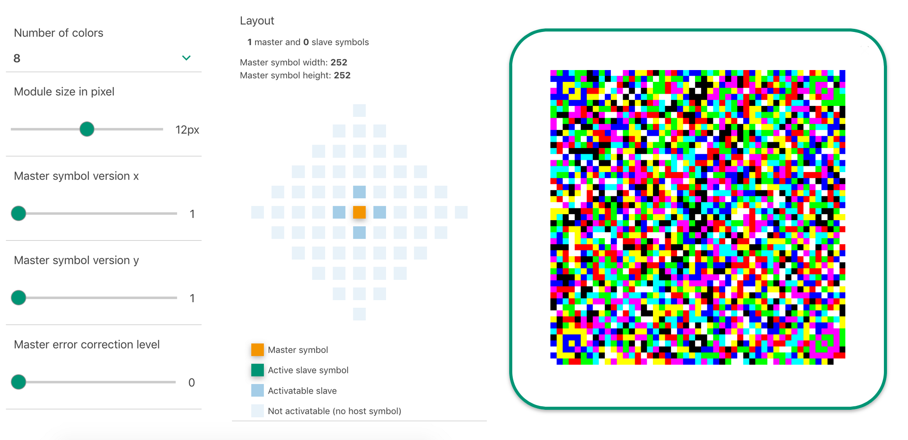

# JAB Code

JAB Code (Just Another Bar Code) is a high-capacity 2D color bar code, which can encode more data than traditional black/white (QR) codes. This repository contains a library for reading and writing JAB codes, along with sample applications. A demo webinterface is available at https://jabcode.org.

## Introduction

JAB Code is a color two-dimensional matrix symbology whose basic symbols are made of colorful square modules arranged in either square or rectangle grids. JAB Code has two types of basic symbols, named as master symbol and slave symbol. A JAB Code contains one master symbol and optionally multiple slave symbols. Master symbol contains four finder patterns located at the corners of the symbol, while slave symbol contains no finder pattern. A slave symbol can be docked to a master symbol or another docked slave symbol in either horizontal or vertical direction. JAB Code can encode from small to large amount of data correlated to user-specified percentages of error correction.

A demo webinterface is [provided](https://jabcode.org/create) to evaluate the library:

## Project Structure
    .
    ├── docs                  # Documentation
    └── src                   # Source code
         ├── jabcode          # JAB Code core library
         ├── jabcodeReader    # JAB Code reader application
         └── jabcodeWriter    # JAB Code writer application

## Build Instructions
The JAB Code core library, reader and writer applications are written in C (C11) and tested under Ubuntu 14.04 with gcc 4.8.4 and GNU Make 3.8.1. 

Follow the following steps to build the core library and applications. 

Step 1: Build the JAB Code core library by running make command in `src/jabcode`.

Step 2: Build the JAB Code writer by running make command in `src/jabcodeWriter`.

Step 3: Build the JAB Code reader by running make command in `src/jabcodeReader`.

The built library can be found in `src/jabcode/build`. The built reader and writer applications can be found in `src/jabcodeReader/bin` and `src/jabcodeWriter/bin`.

## Usage
The usage of jabcodeWriter and jabcodeReader can be obtained by running the programs with the argument `--help`.

##### jabcodeReader
run `jabcodeReader --help` for the detailed usage

##### jabcodeWriter
run `jabcodeWriter --help` for the detailed usage

## Documentation

* The API documentation is available at [Documentation](https://jabcode.github.io/jabcode/)
* The technical specification of the barcode is available as [BSI TR03137 - Part 2](https://www.bsi.bund.de/EN/Publications/TechnicalGuidelines/TR03137/BSITR03137.html)
